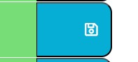

# work-day-scheduler

The work day scheduler is created to allow users to add events to the schedule. The timeblocks are dynamically colour coded to show the past, present and future times available for scheduling.
The events are saved to local storage so even if a use refreshes the page, their event will remain on the page.

(https://smntsng.github.io/work-day-scheduler/)

## Instructions

1. Add an event to the time block and click save
  
 

 
2. when you come back to this page, your event will still remain on the page.

## License

